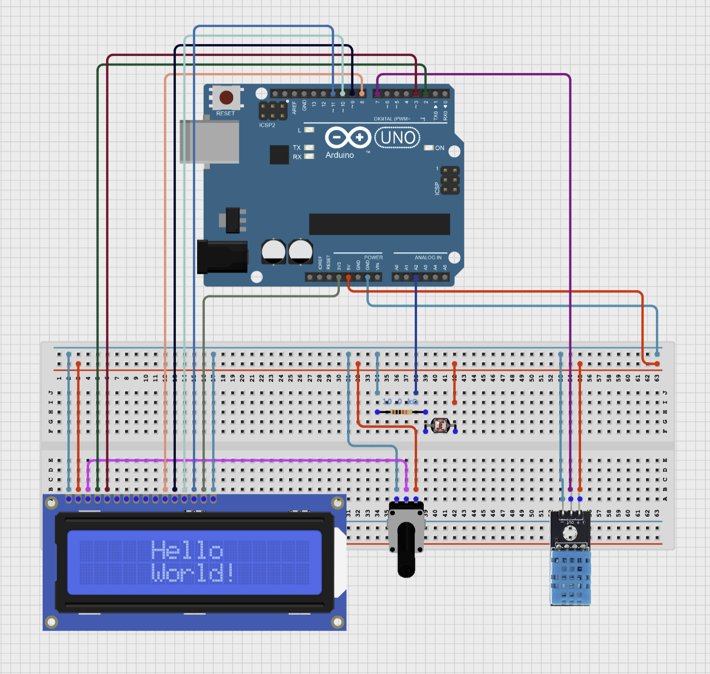

# Climate Monitor

## Scope & Purpose
As part of my ongoing Arduino learning, I built a small project using the DHT11 temperature and humidity sensor along with a photoresistor to measure and display temperature (°C), humidity (%), and light intensity (%). The data is shown on a 16x2 Liquid Crystal Display.

## Circuit Diagram

## Demo
[Watch Demo](https://youtube.com/shorts/g7RLMQtHDNw?feature=share)

## License
[MIT](https://opensource.org/license/mit/)
